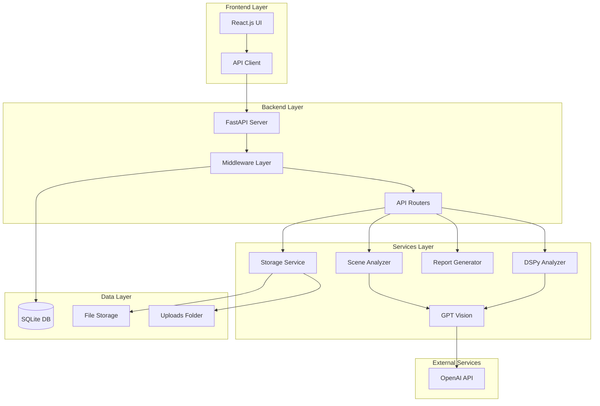
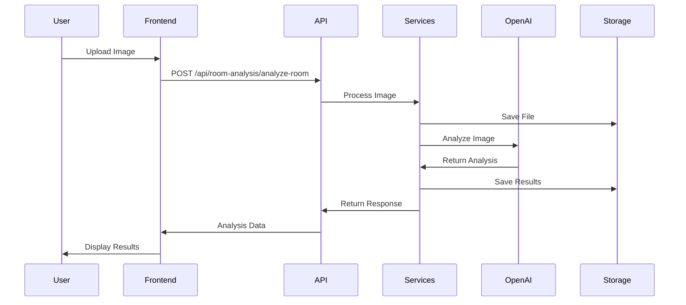

# System Architecture

## 🏗️ Overview

The Room Intelligence & Object Detection System is built using a modern, scalable architecture that separates concerns between the AI processing backend and the interactive frontend. The system leverages microservices principles with clear APIs and modular components.

## 📊 High-Level Architecture



## 🎯 Component Architecture

### Frontend Architecture

#### Technology Stack
- **React.js 18**: Component-based UI framework
- **Vite**: Fast build tool and development server
- **Tailwind CSS**: Utility-first CSS framework
- **Axios**: HTTP client for API communication

#### Component Hierarchy
```
src/
├── components/           # Reusable UI components
│   ├── ImageUpload.jsx      # File upload interface
│   ├── AnalysisDisplay.jsx  # Results visualization
│   ├── ObjectsTable.jsx     # Data table component
│   ├── SceneAnalysis.jsx    # Scene analysis view
│   ├── RoomAnalysis.jsx     # Room analysis interface
│   └── SurveyorDashboard.jsx # Main dashboard
├── api/                  # API integration
│   └── api.js               # HTTP client configuration
├── utils/                # Helper functions
│   ├── exportService.js     # Export functionality
│   ├── offlineStorage.js    # Local storage management
│   └── syncService.js       # Data synchronization
└── main.jsx             # Application entry point
```

#### Key Components

**ImageUpload.jsx**
- Drag-and-drop file upload
- Image preview and validation
- Multi-format support (JPG, PNG, GIF)
- Progress tracking

**AnalysisDisplay.jsx**
- Results visualization
- Interactive object highlighting
- Data export options
- Report generation controls

**ObjectsTable.jsx**
- Structured data display
- Sortable columns
- Filter capabilities
- Cost calculations

### Backend Architecture

#### Technology Stack
- **FastAPI**: Async web framework
- **Python 3.11**: Modern Python with type hints
- **Pydantic**: Data validation and serialization
- **SQLite**: Lightweight database with WAL mode
- **python-docx**: Document generation

#### Service Architecture
```
app/
├── main.py              # FastAPI application setup
├── config.py            # Configuration management
├── models.py            # Pydantic data models
├── middleware.py        # Request/response middleware
├── database.py          # Database connection
├── routers/             # API endpoint definitions
│   ├── health.py            # Health check endpoints
│   ├── upload.py            # File upload handling
│   ├── room_analysis.py     # Room analysis API
│   ├── detection.py         # Object detection API
│   ├── export.py            # Data export API
│   ├── transactions.py      # Transaction logging
│   └── config.py            # Configuration API
└── services/            # Business logic layer
    ├── scene_analyzer.py    # Traditional scene analysis
    ├── dspy_scene_analyzer.py # DSPy-based analysis
    ├── gpt_vision.py        # OpenAI integration
    ├── report_generator.py  # Document generation
    ├── storage.py           # File management
    ├── image_processor.py   # Image processing
    └── exif_extractor.py    # Metadata extraction
```

#### Key Services

**DSPy Scene Analyzer**
- Structured prompting framework
- Consistent output validation
- Multi-stage analysis pipeline
- Error handling and fallbacks

**Scene Analyzer (Traditional)**
- Direct GPT-4 Vision integration
- Legacy prompt handling
- Backward compatibility
- Custom validation logic

**Report Generator**
- Word document creation
- Template-based generation
- Image embedding
- Professional formatting

## 🔄 Data Flow

### Image Analysis Pipeline

1. **Upload Phase**
   ```
   User Upload → Validation → Storage → Queue
   ```

2. **Analysis Phase**
   ```
   Image → Base64 Encoding → GPT-4 Vision → Structured Output
   ```

3. **Processing Phase**
   ```
   Raw Analysis → DSPy Validation → Data Structure → Storage
   ```

4. **Report Phase**
   ```
   Structured Data → Template → Word Document → Download
   ```

### Request Flow



## 🗄️ Data Models

### Pydantic Models

**ObjectItem Model**
```python
class ObjectItem(BaseModel):
    category: str = Field(description="Standard category")
    object: str = Field(description="Object name with exact count")
    details: str = Field(description="Detailed description")
    position: str = Field(description="Position in image")
    estimated_cost: str = Field(description="Cost in INR")
```

**SceneAnalysisResult Model**
```python
class SceneAnalysisResult(BaseModel):
    scene_type: str = Field(description="Scene type classification")
    scene_overview: str = Field(description="Comprehensive summary")
    simplified_data: List[ObjectItem] = Field(description="Detected objects")
    key_observations: List[str] = Field(description="Key findings")
```

### Database Schema

**Transaction Log Table**
```sql
CREATE TABLE transactions (
    id INTEGER PRIMARY KEY,
    timestamp TEXT,
    method TEXT,
    endpoint TEXT,
    status_code INTEGER,
    processing_time REAL,
    metadata JSON
);
```

## 🔧 Configuration Management

### Environment Variables

```bash
# Core Configuration
OPENAI_API_KEY=your-api-key-here
ENVIRONMENT=development
HOST=127.0.0.1
PORT=8000
RELOAD=true

# Storage Configuration
UPLOAD_FOLDER=uploads
RESULTS_FOLDER=results
MAX_FILE_SIZE=50MB

# CORS Configuration
CORS_ORIGINS=["http://localhost:3000"]
```

### Configuration Files

**Backend Config** (`app/config.py`)
- Environment variable loading
- Default value management
- Validation and type checking
- Runtime configuration

**Frontend Config** (`vite.config.js`)
- Development server setup
- Build optimization
- Asset handling
- Proxy configuration

## 🛡️ Security Architecture

### Authentication & Authorization
- API key validation for OpenAI
- CORS policy enforcement
- File upload restrictions
- Input validation and sanitization

### Data Protection
- Secure file storage
- Database encryption
- API rate limiting
- Error message sanitization

### File Security
- Extension validation
- File size limits
- Malware scanning capabilities
- Secure temporary storage

## 📈 Scalability Considerations

### Horizontal Scaling
- Stateless service design
- Database connection pooling
- Load balancer compatibility
- Container-ready architecture

### Performance Optimization
- Async/await implementation
- Request/response compression
- Image optimization
- Caching strategies

### Monitoring & Observability
- Transaction logging
- Error tracking
- Performance metrics
- Health check endpoints

## 🔄 Integration Points

### OpenAI Integration
- GPT-4 Vision API
- Rate limit handling
- Error recovery
- Cost optimization

### DSPy Framework
- Structured signatures
- Chain-of-thought reasoning
- Automatic prompt optimization
- Validation pipeline

### Document Generation
- Word template system
- Image embedding
- Dynamic content insertion
- Format standardization

---

This architecture provides a robust, scalable foundation for the Room Intelligence system while maintaining clear separation of concerns and enabling future enhancements.